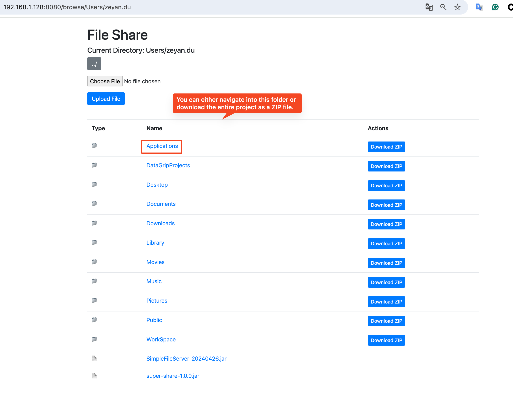

# Super Share


Super Share is a simple file sharing server written in Kotlin.

It allows you to share files over HTTP, making it easy to transfer files between devices on the same network.



## Commands for development

```bash
./gradlew run
```

```bash
./gradlew ktlintFormat
```

## How to get the application

1. Build by yourself by running and find super-share-1.0.0.jar in `build/libs` directory
    ```bash
    ./gradlew shadowJar
    ```

2. Download the jar file, exe or dmg from the [release page](https://github.com/gonBorn/super-share-tool/releases)

## How to use it

1. Make sure you have Java 21 or higher installed on your machine.
2. Run the jar file with the following command in any directory that you want to share:
    ```bash
    java -jar super-share-1.0.0.jar
    ```
   or you can specify the port number to run the server on:
    ```bash
    java -jar /path/to/super-share-1.0.0.jar 8081
    ```
