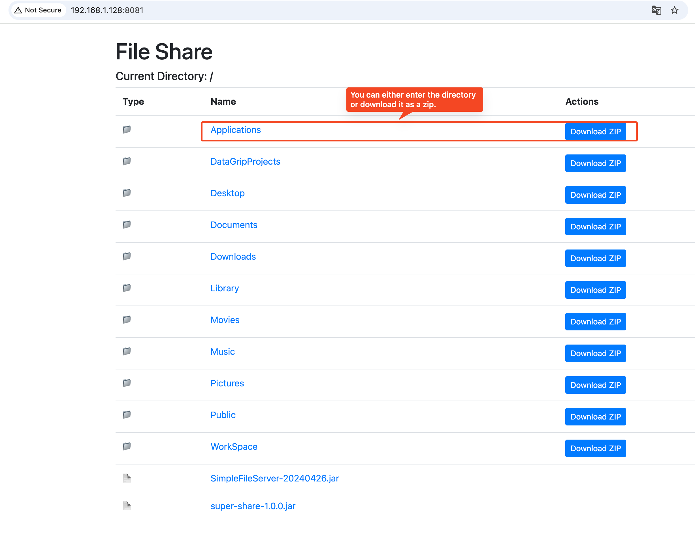

# Super Share

```bash
./gradlew run
```

```bash
./gradlew ktlintFormat
```

### What is it?

Super Share is a simple file sharing server written in Kotlin.

It allows you to share files over HTTP, making it easy to transfer files between devices on the same network.



### How to use it

1. Build the fat jar by running:
    ```bash
    ./gradlew shadowJar
    ```

2. Find super-share-1.0.0.jar in `build/libs` directory
3. Run the jar file with the following command in any directory that you want to share:
    ```bash
    java -jar build/libs/super-share-1.0.0.jar
    ```
   or you can specify the port number to run the server on:
    ```bash
    java -jar /path/to/super-share-1.0.0.jar 8081
    ```