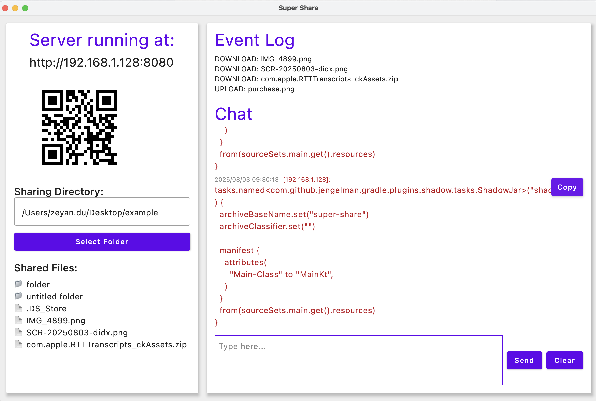

# Super Share


Super Share is a simple file sharing server written in Kotlin.

It allows you to share files over HTTP, making it easy to download, upload files and even send messages between devices
on the same network.

## User Handbook

1. Download the **jar** file, **exe** or **dmg** from
   the [release page](https://github.com/gonBorn/super-share-tool/releases)

2. Run it no matter on Mac or Windows laptop, you can see the window like this:

   

3. Type the ip address or scan the QR code in another device to access the super-share web interface,
   where you can
    - upload and download files
    - send and receive messages

  
   <br>
  

### MacOS Installation

- Issue: Apple could not verify free of malware that may harm your Mac or compromise your privacy.
- Solution: Run the following command in the terminal to remove the quarantine attribute:
   ```bash
   xattr -d com.apple.quarantine /Applications/SuperShare.app
   ```

## Developer Handbook

Make sure you have Java 21 or higher installed on your machine.

```bash
./gradlew run
```

```bash
./gradlew ktlintFormat
```

```bash
./gradlew shadowJar
```

Run the jar file with the following command in any directory that you want to share:

 ```bash
 java -jar super-share-1.0.0.jar
 ```

or you can specify the port number to run the server on:

 ```bash
 java -jar super-share-1.0.0.jar 8081
 ```
